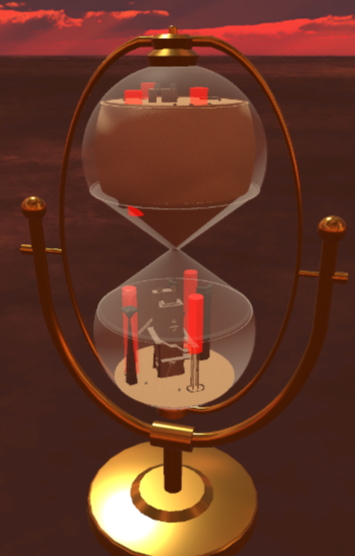
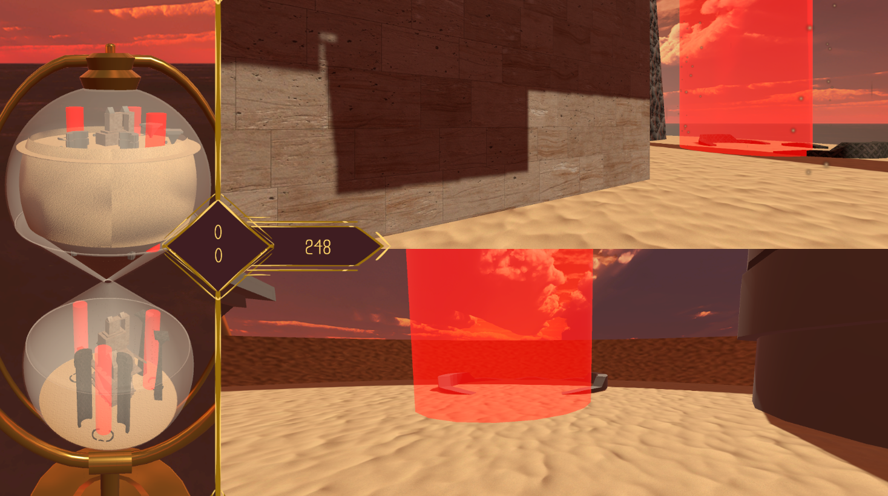
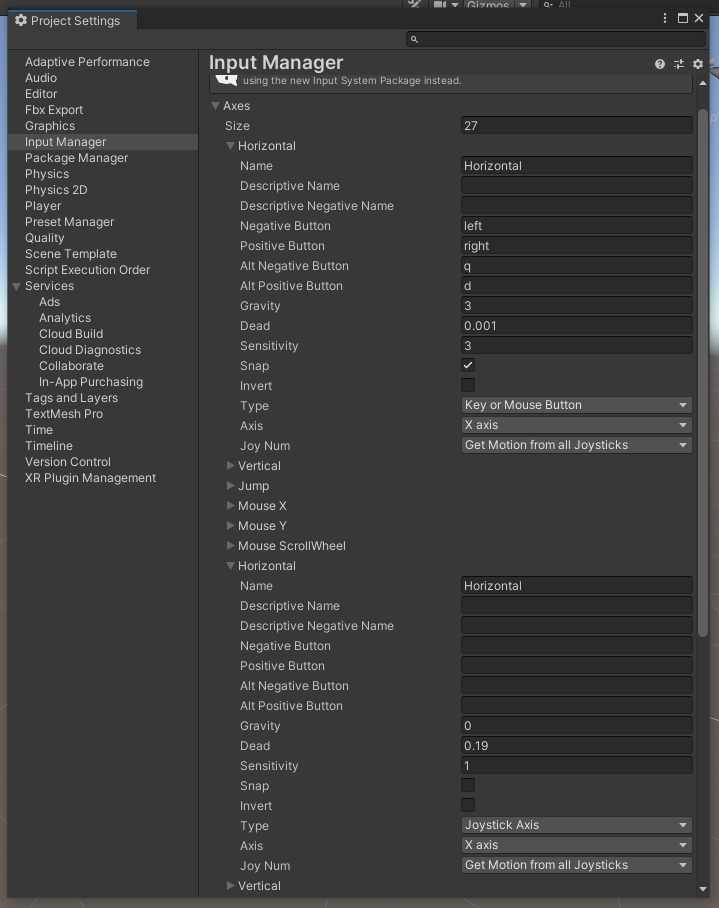
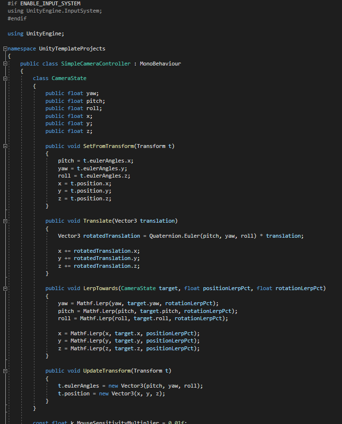
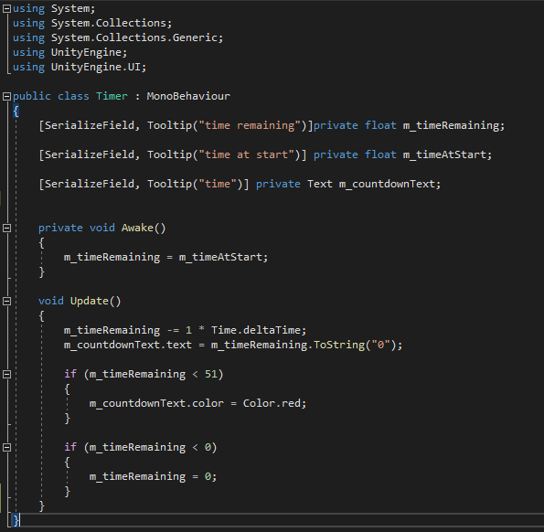

# Espace__Temps
ESPACE TEMPS

Game Jam by Play Curious in april 2022

Click [here](https://loudebwa.itch.io/espace-temps) to Play the game.

Stuck inside a hourglass, two players have a challenge to face :

As long as the sand is flowing down, you must find the jars and 
bring them to the key zones to score, then try to get points as 
much as possible to beat your friend.

In this project I programmed the mechanics of the game.

The main challenge was the setup of multiple controllers 
for local multiplayer.

Due to the fact that this project was for a game jam, the code isn't the 
most optimal but it worked proprerly for the game.

I also coded a chronometer with minuts and seconds 

Thanks to this experience, I learned much more
about Unity and its C#.
I am very proud of the work we achieved with the team in less than 48h.

And the jury really liked our game !

